<h1 align="center"># README - ☠️Estudio de Tatuajes Frontend☠️</h1>

__<p align="center">Proyecto 4 - Frontend de un estudio de tatuajes - Semanas 9 y 10</p>__

__<p align="center">Github pages: https://andreslabat.github.io/Proyecto5estudioDeTatuajesFrontend/</p>__


<p align="center">Frontend de un estudio de tatuajes, por Andrés Labat.
<br>
Desarrollado como parte del Bootcamp de Full Stack Developer de Geekshubs Academy.</p>

<p>
   <div align="center">
      
   </div>    
</p>
<p>
   <div align="center">
      <em><b>Bienvenido a este proyecto</b></em>
   </div>   
<p align="center">_______________________________________________</p>

**Estudio de Tatuajes frontend** es un proyecto que recrea el frontend de un estudio de tatuajes utilizando React, Javascript, HTML, CSS, GIT y GitHub. Este proyecto se conecta el backend del proyecto 4, en el que se aloja una base de datos relacional, así como diversos endpoints que te permiten registrarte, hacer login, acceder a la información almacenada en las tablas, e incluso actualizarla y borrarla.
<p>

<p>
   <div align="center">
      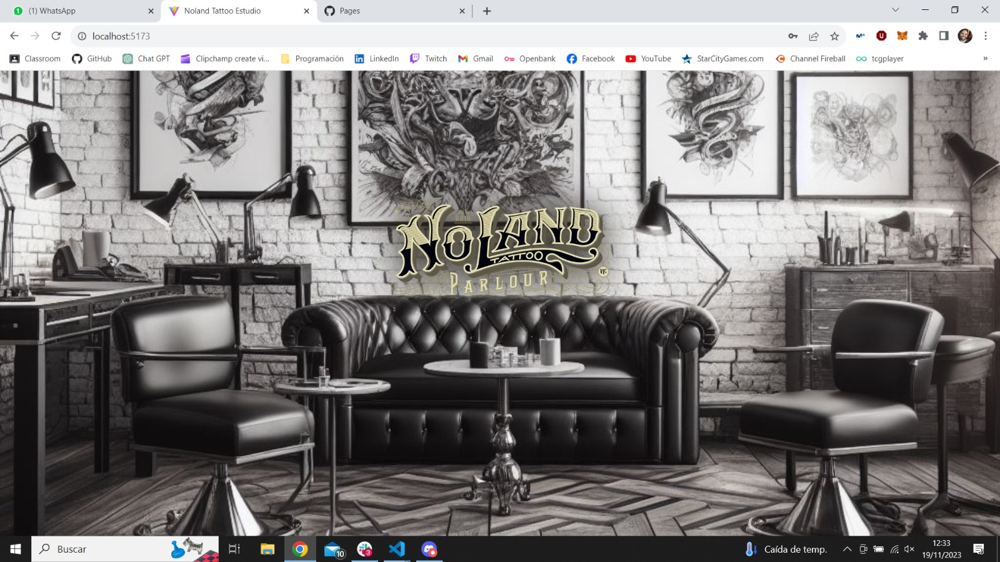
   </div>    
</p>


## 📋 Contenido del Readme

<details>

  <summary>Apartados</summary>
<ol>
    <li><a href="#objetivo">Objetivo</a></li>
    <li><a href="#tecnologías-utilizadas">Tecnologías Utilizadas</a></li>
    <li><a href="#diagrama-bd">Diagrama BD</a></li>
    <li><a href="#ramas-del-repositorio">Ramas del Repositorio</a></li>
    <li><a href="#instrucciones-de-uso">Instrucciones de Uso</a></li>
    <li><a href="#endpoints">Endpoints</a></li>
    <li><a href="#validadores">Validadores</a></li>
    <li><a href="#futuras-funcionalidades">Futuras Funcionalidades</a></li>
    <li><a href="#problemas-y-soluciones">Problemas y Soluciones</a></li>
    <li><a href="#deploy">Deploy</a></li>
    <li><a href="#cómo-contribuir">Cómo Contribuir</a></li>
    <li><a href="#autor">Autor</a></li>
    <li><a href="#licencia">Licencia</a></li>
    <li><a href="#agradecimientos">Agradecimientos</a></li>
  </ol>

</details>

## Objetivo

🎯 Este proyecto requería un diseño web de una única página con diferentes vistas que actualicen el estado de los componentes reaccionando a los eventos que ocurren en la misma.
Su contenido debía de tener como mínimo las siguientes vistas:
- Home.
- Register.
- Login.
- Visualización de los trabajadores.
- Perfil de usuario.
- Ver citas del usuario.
- Crar cita.
- Actualizar cita.
- Vistas específicas del super admin, tales como ver todos los usuarios o todas las citas de la aplicación.

## Contenido del Proyecto

🏗️ El proyecto **Estudio de Tatuajes frontend** consta de las siguientes vistas:

1. **🔌Home🔌**: Página principal de bienvenida, una vez haces click en la imagen, se muestran los trabajadores y tatuajes más destacados.

<p>
   <div align="center">
      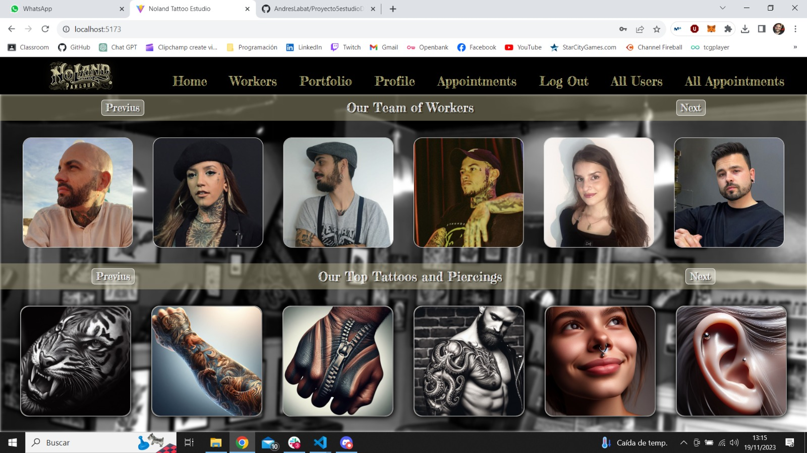
   </div>    
   <div align="center">
      <em><b>Trabajadores y tatuajes más destacados</b></em>
   </div>   
</p>

2. **👀Workers👀**: Esta vista contiene una serie de cards giratorias de los trabajadores, al poner el ratón sobre ellas, se muestra la información de dicho trabajador.

<p>
   <div align="center">
      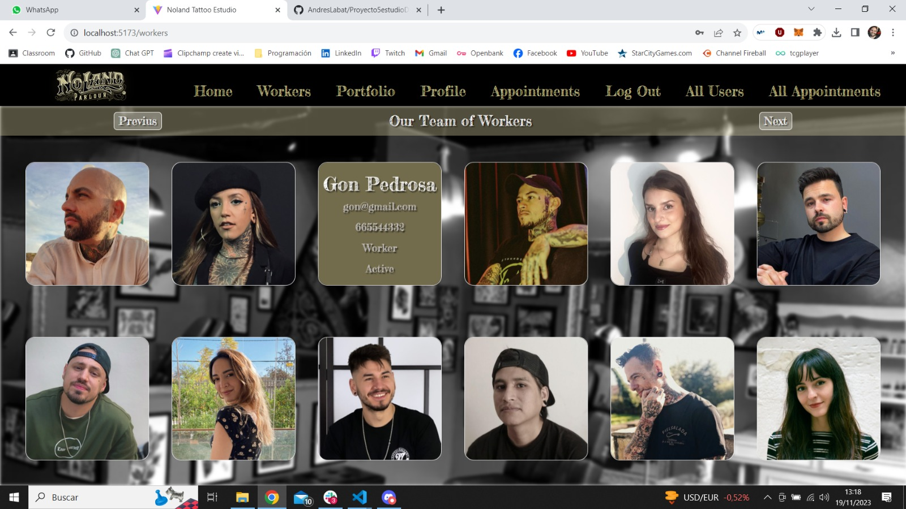
   </div>    
   <div align="center">
      <em><b>Información de los trabajadores</b></em>
   </div>   
</p>

3. **📓Portfolio📓**: Esta vista contiene una serie de cards con formato de libro de los servicios que se ofrecen, tanto tatuajes como piercings, al poner el ratón sobre ellas, se muestra la información de dicho servicio.

<p>
   <div align="center">
      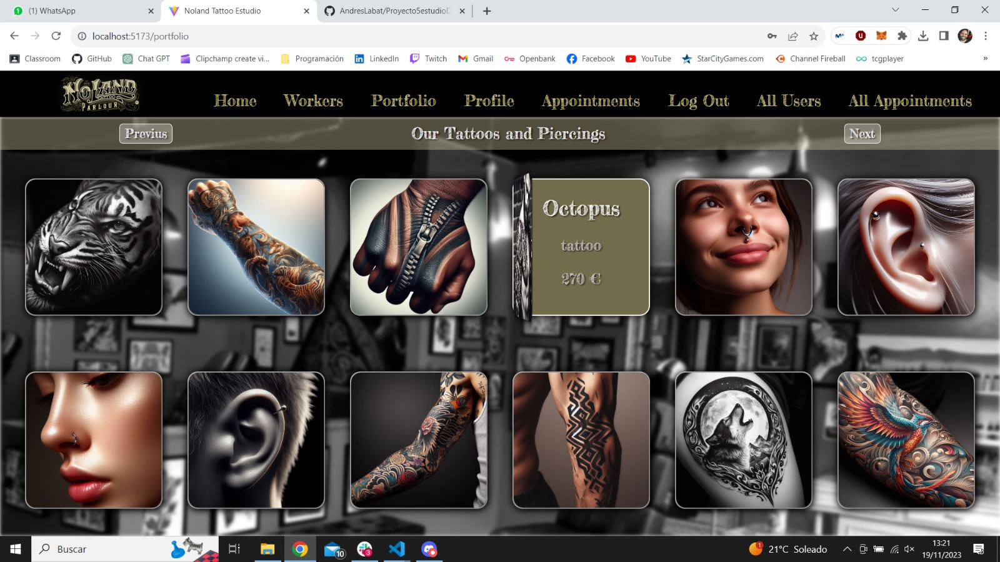
   </div>    
   <div align="center">
      <em><b>Información de los servicios</b></em>
   </div>   
</p>

4. **🌠Login🌠**: Identificarte mediante el login te permitirá poder reservar, actualizar o borrar citas.

<p>
   <div align="center">
      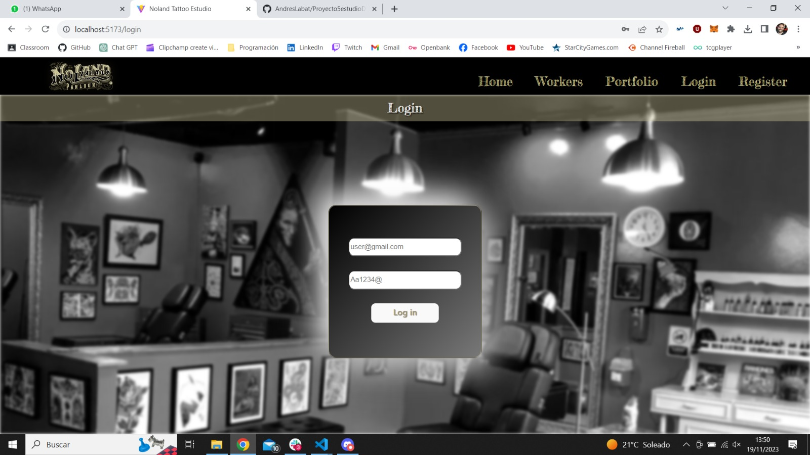
   </div>    
   <div align="center">
      <em><b>Identificación mediante correo y contraseña</b></em>
   </div>   
</p>

5. **⭐Register⭐**: Cuando te creas una cuenta por primera vez, una vez introduzcas tus datos personales automaticamente se logeara, permitiendote acceder a todas las ventajas que ello conlleva.

<p>
   <div align="center">
      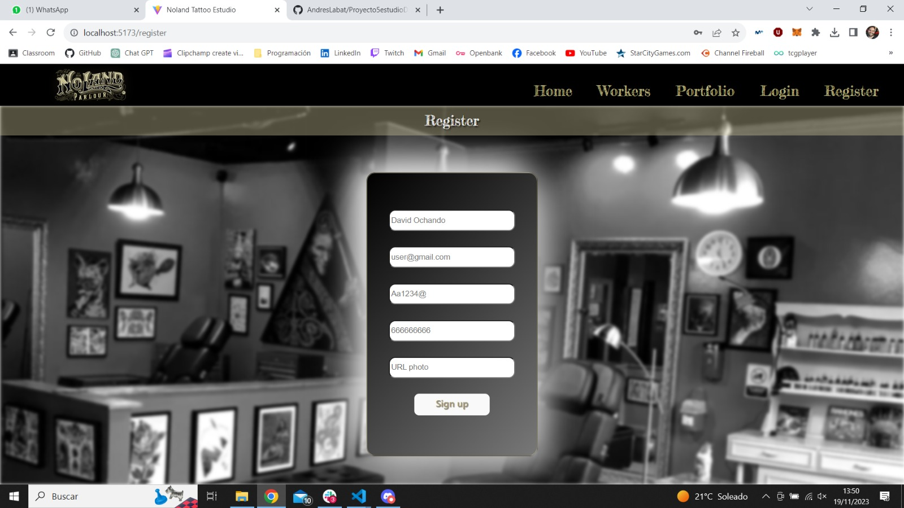
   </div>    
   <div align="center">
      <em><b>No es obligatorio introducir una foto</b></em>
   </div>   
</p>

6. **🔠Profile🔠**: Aquí se muestra la información del usuario previamente registrado, su foto y un acceso a poder actualizar sus datos.

<p>
   <div align="center">
      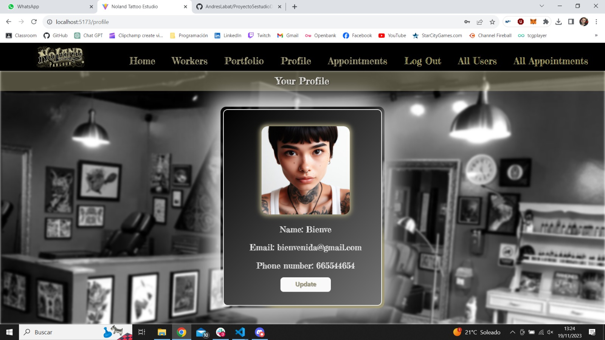
   </div>    
   <div align="center">
      <em><b>Se muestran los datos del usuario</b></em>
   </div>   
</p>


7. **🔠Update Profile🔠**: Podremos cambiar nuestro nombre, contraseña, telefono e incluso foto desde este formulario..

<p>
   <div align="center">
      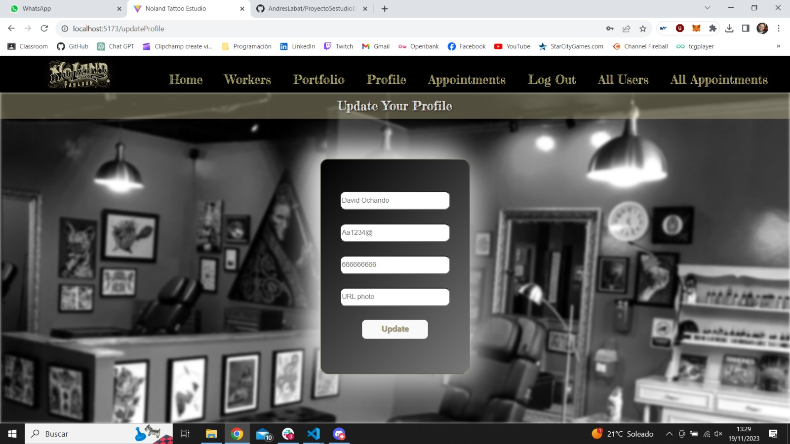
   </div>    
   <div align="center">
      <em><b>Introduce tus nuevos datos de usuario</b></em>
   </div>   
</p>

8. **🎰Appointments🎰**: Aparecerá un listado con todas las citas que tenga el usuario y la información relevante sobre ellas, además podra verlas en detalle pulsando en el botón "Details", actualizarla o incluso eliminarla.

<p>
   <div align="center">
      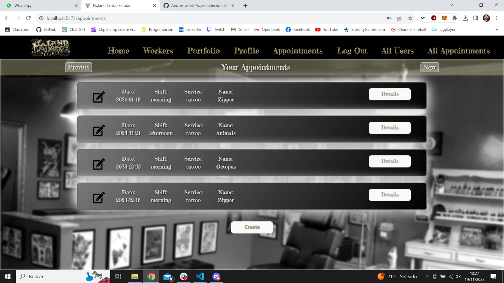
   </div>    
   <div align="center">
      <em><b>Listado de citas y acceso a crear una nueva</b></em>
   </div>   
</p>

<p>
   <div align="center">
      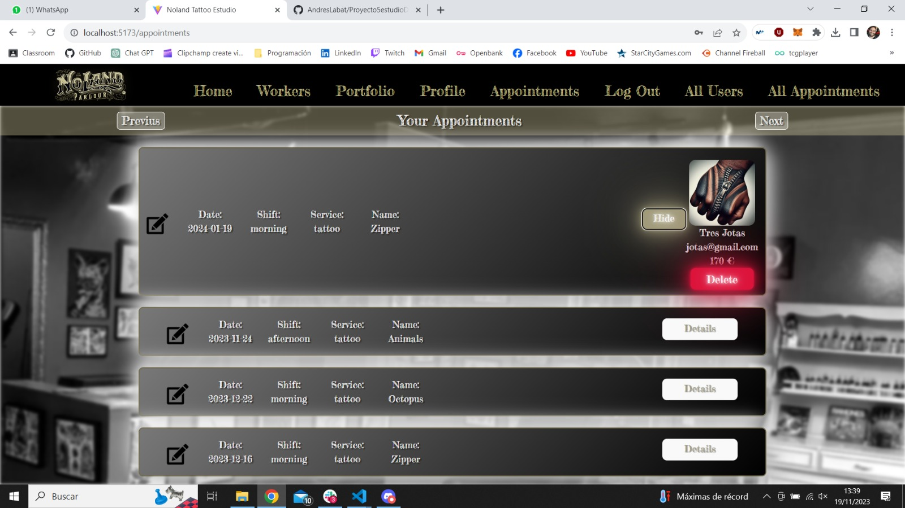
   </div>    
   <div align="center">
      <em><b>Si pulsamos en details podremos eliminar la cita</b></em>
   </div>   
</p>

9. **🎰Create Appointment🎰**: Podremos elegir que tatuajes y con que tatuador hacernoslo además de la fecha y el turno de dicho trabajador, pero solo si tiene disponibilidad".

<p>
   <div align="center">
      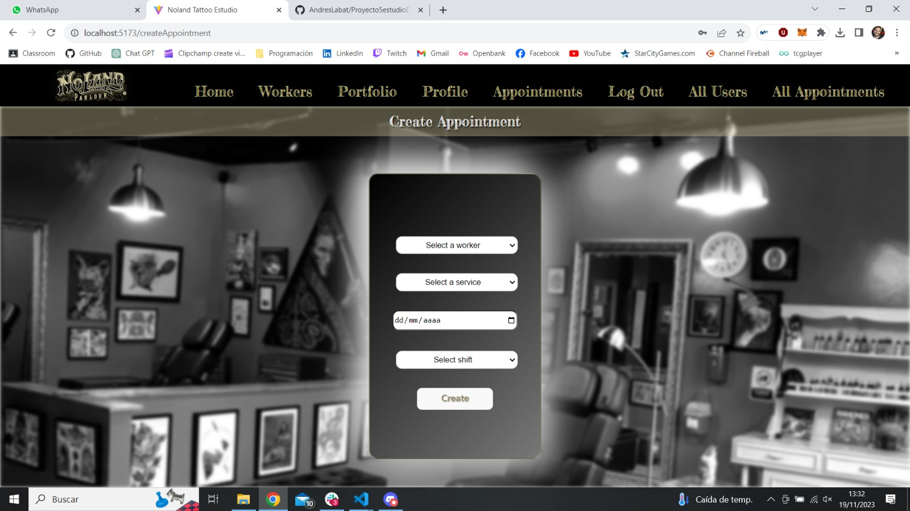
   </div>    
   <div align="center">
      <em><b>Introduce y elige tus preferencias para una nueva cita</b></em>
   </div>   
</p>


10. **🎰Update Appointment🎰**: En el caso en el que necesitemos modificar los datos de una cita, podremos editar el servicio, el trabajador, le fecha y el turno, siempre y cuando haya disponibilidad.

<p>
   <div align="center">
      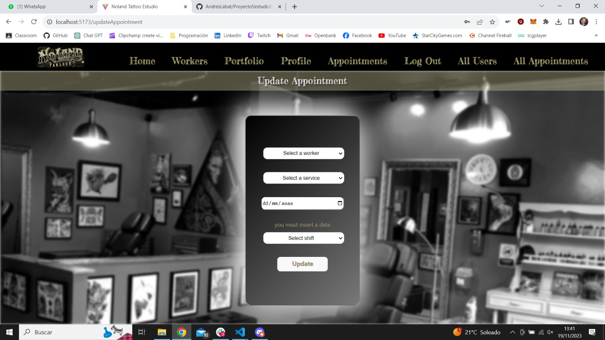
   </div>    
   <div align="center">
      <em><b>Modifica los datos de una cita según disponibilidad</b></em>
   </div>   
</p>

11. **👑All Users👑**: Solo accesible para el "super admin", se visualiza a todos los usuarios de la aplicación con cards giratorias, donde además se muestra información detallada de todos los usuarios registrados, ya sean clientes o trabajadores.

<p>
   <div align="center">
      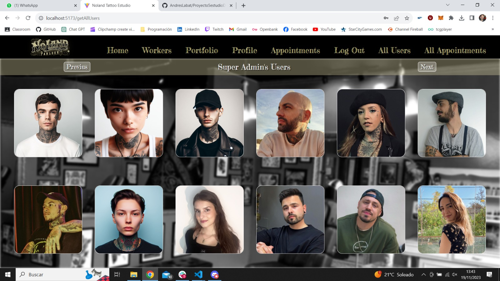
   </div>    
   <div align="center">
      <em><b>Se muestran los clientes y trabajadores registrados</b></em>
   </div>   
</p>

12. **👑All Appointments👑**: Esta vista solo es accesible para el "super admin", en ella se muestran todas las citas de la aplicación con todo lujo de detalles, desde quién es el cliente o el trabajador hasta información del servicio contratado.

<p>
   <div align="center">
      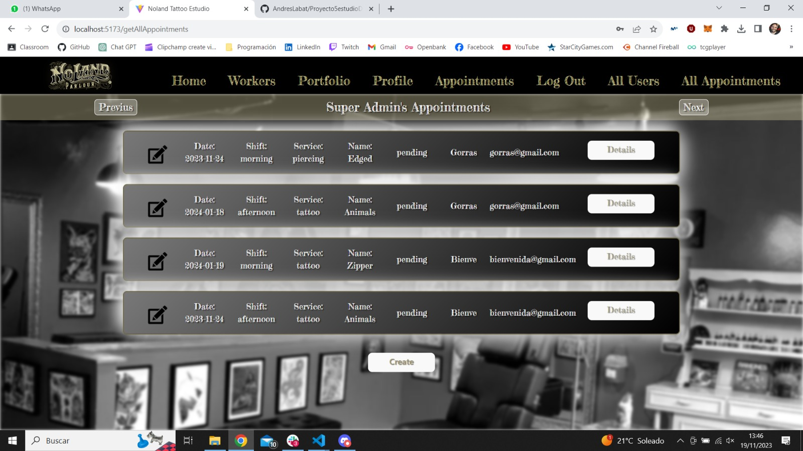
   </div>    
   <div align="center">
      <em><b>Siempre tendrá 6 colores, pero el número de intentos lo determinará el jugador</b></em>
   </div>   
</p>

## 🎨Diseño Responsive

Todo el diseño del sitio web es responsive, lo que significa que se adapta a diferentes dispositivos y tamaños de pantalla gracias al uso de display flex y de media querys. Esto garantiza una experiencia de usuario óptima tanto en computadoras de escritorio como en dispositivos móviles.

## Tecnologías Utilizadas

<details>
<summary>🔧 Tecnologías</summary>

- **React**: Combinando Html y Javascript en archivos "jsx", es la tecnología principal con la que se ha creado este proyecto, permitiniendonos un diseño de una sola página con varias vistas y componentes que reaccionan a los distintos cambios de estado en tiempo real.


- **HTML**: Utilizado para estructurar la página web.


- **CSS**: Aplicado para dar estilo y diseño a todo el html.


- **JavaScript**: Utilizado para controlar las interacciones y las funciones de cada elemento que lo requiera.


- **Git**: Sistema de control de versiones para el seguimiento de cambios en el proyecto.
  <code></code>

- **GitHub**: Plataforma para alojar el repositorio en línea y colaborar en el desarrollo del proyecto.
    <code></code>

</details>

## Ramas del Repositorio

🍃 Este proyecto se ha desarrollado en cuatro ramas:
- En la rama "dev" se ha desarrollado la mayor parte de la lógica y las vistas, realizando así las labores de maquetación y estilos con CSS. 
- En la rama "redux" se dejo de guardar la información en el local storage y en su lugar se utilizó redux, 
- En la rama "readme" se ha creado toda la documentación del proyecto y ultimado detalles
- En la rama "master" converge todo este desarrollo en las diferentes ramas uniendolas en una rama principal.

## Instrucciones de Uso

<details>
<summary>⚙️ Instrucciones</summary>

1. Clona este repositorio en tu máquina local usando el siguiente comando: `git clone [URL del repositorio]`.

2. Clona el repositorio del proyecto 4, estudio de tatuajes backend, en tu máquina local usando el siguiente comando: `git clone [URL del repositorio]`.

3. Ejecuta el comando `npm run dev` en la consola del proyecto 4, estudio de tatuajes backend, para levantar el servidor backend.

4. Ejecuta el comando `npm run dev` en la consola de este proyecto para levantar el servidor frontend.

5. Disfruta de una página web completamente funcional, registrate, crea citas y explora el rico mundo del arte de los tatuajes.

## Futuras Funcionalidades

🚄 Crear nuevas vistas en las que poder hacer que sea una web más completa y funcional:
- Create portfolio: para introducir nuevos tatuajes y piercings. 
- Change role: para que el super admin pueda hacer que cualquier usuario sera trabajador o super admin.  
- Delete portfolio: para poder eliminar tatuajes y piercings por parte de los trabajadores.

## Problemas y Soluciones

### 1. Al crear las relaciones many to many entre dos tablas fuertes sin crear las one to many de la tabla intermedia a la fuerte.

- **🚧Problema**: Al crear las relaciones many to many entre dos tablas fuertes sin crear las one to many de la tabla intermedia a la fuerte no podía con una única búsqueda acceder a toda la información que necesitaba al estar en dos tablas distintas sin una relación directa creada.

   - **💡Solución**: establecer una relación one to many de las tablas fuertes a la intermedia, de forma que ahora con el nuevo atributo puedes acceder a toda la información de la tabla en forma de array y evitas hacer más de una consulta.

<p>
   <div align="center">
      
   </div>    
   <div align="center">
      <em><b>Aqui se ve la relación many to one de la tabla intermedia a sus dos tablas fuertes</b></em>
   </div>   
</p>

### 2. Los endpoints contienen demasiadas líneas y demasiada lógica al tener muchos validadores.

- **🚧Problema**: cada endpoint contiene toda su lógica propia y todos los validadores de los datos de entrada, por lo que tienen mucha responsabilidad y ocupan demasiadas líneas de código.

   - **💡Solución**: abstraer los validadores a un archivo independiente llamado validations.ts e importarlos en los endpoints cuando son necesarios.

<p>
   <div align="center">
      
   </div>    
   <div align="center">
      <em><b>Cada validador contiene su lógica y es exportado para su uso en los controladores</b></em>
   </div>   
</p>

## Deploy

🚀 Por el momento su único uso es en local pese a tener un Github pages, en el futuro se realizará el deploy tanto de este proyecto, como de el anterior, en el que se aloja tanto al servidor como la base de datos.

## Cómo Contribuir

🤝 Si deseas contribuir a este proyecto, puedes realizar un fork del repositorio en GitHub, hacer tus cambios y enviar una solicitud de extracción (pull request). Tu contribución será revisada y, si es apropiada, se fusionará con la rama principal.

1. Haz un fork de este repositorio.

2. Crea una nueva rama para tu contribución: `git checkout -b tu-nueva-caracteristica`.

3. Realiza tus cambios y commitea: `git commit -m "Añade una nueva característica"`.

4. Envía tus cambios al repositorio: `git push origin tu-nueva-caracteristica`.

5. Crea una solicitud de extracción en GitHub.

Espero que disfrutes explorando y utilizando este frontend del estudio de tatuajes. Si tienes alguna pregunta o necesitas asistencia, no dudes en ponerte en contacto conmigo a través de la información de contacto proporcionada.

## Autor

``` js
 const developer = "Andrés Labat Beltrán";

 console.log("Desarrollado por: " + developer);
```  

- **Nombre**: Andrés Labat Beltrán
- **Fecha de Comienzo del Proyecto**: 26/10/2023
- **Email**: andreslabat89@gmail.com.
- **Linkedin**: https://www.linkedin.com/in/andrés-labat-beltrán/.

## Licencia

⚖️ Este proyecto está bajo la Licencia MIT. Consulta el archivo `LICENSE` para obtener más información.

## Agradecimientos

👏 Agradecimentos a GeeksHubs Academy por los conocimientos que he podido adquirir estas diez semanas y que han hecho posible este proyecto, y a nuestros queridos profesores David Ochando y Dani Tarazona y su gran paciencia con nosotros.

<p>
   <div align="center">
      
   </div>    
</p>

Quiero hacer una mención especial a mi mujer, Alba, ya que sin su apoyo e inspiracion ni este ni ningún otro proyecto llegarían a ser una realidad.

¡Gracias por visitar **Estudio de tatuajes frontend** y explorar mi proyecto!